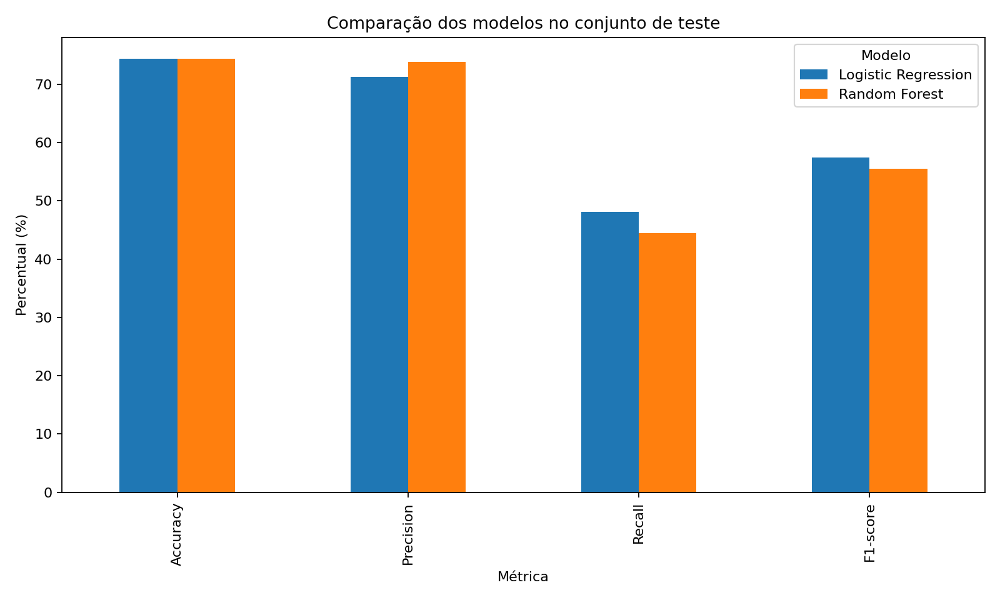
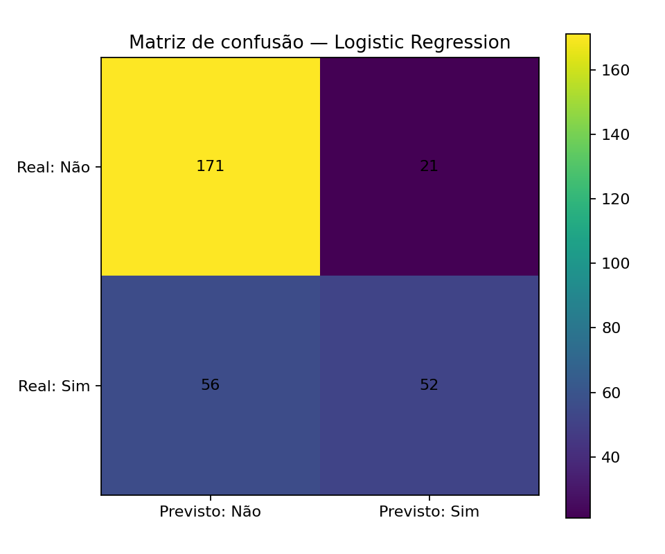

# 📉 Customer Churn Prediction com Machine Learning

Projeto de **Machine Learning para classificação de churn de clientes**, desenvolvido em Python com foco em preparação de dados, prevenção de vazamento de informações, construção de pipelines e comparação entre modelos de classificação.

O objetivo é prever se um cliente tende a **permanecer (`Não`)** ou **sair (`Sim`)** a partir de características contratuais, financeiras e comportamentais.

> **Observação:** o dataset utilizado é sintético e foi criado exclusivamente para fins educacionais. Os resultados não representam uma empresa real e não devem ser interpretados como um modelo pronto para produção.

---

## 🎯 Objetivo do projeto

Construir e comparar modelos capazes de identificar clientes com maior probabilidade de churn, seguindo um fluxo reproduzível de Machine Learning:

```text
Base de dados
    ↓
Validação do alvo
    ↓
Separação X / y
    ↓
Treino / teste estratificado
    ↓
Pré-processamento
    ↓
Pipeline
    ↓
Logistic Regression
    ↓
Random Forest
    ↓
Avaliação e comparação
```

---

## 📊 Base de dados

A base possui:

- **1.500 clientes**
- **18 colunas**
- **539 clientes com churn (35,93%)**
- **961 clientes sem churn (64,07%)**
- variáveis numéricas, ordinais e categóricas
- valores ausentes propositalmente incluídos para prática de tratamento

O identificador `Cliente_ID` é removido antes do treinamento por não possuir significado preditivo.

### 📁 Arquivos principais

- [📊 Base de dados — customer_churn_ml.csv](customer_churn_ml.csv)
- [📖 Dicionário de dados](data_dictionary.md)
- [📓 Notebook completo — churn_modeling.ipynb](churn_modeling.ipynb)

---

## 🧠 Etapas realizadas

### 1. Separação entre características e alvo

- `X`: variáveis utilizadas pelo modelo
- `y`: variável `Churn`
- conversão do alvo:
  - `Não` → `0`
  - `Sim` → `1`

### 2. Divisão de treino e teste

Foi utilizada uma divisão de:

- **80% treino:** 1.200 clientes
- **20% teste:** 300 clientes

```python
train_test_split(
    X,
    y,
    test_size=0.20,
    random_state=42,
    stratify=y
)
```

`stratify=y` preserva aproximadamente a proporção de churn nos dois conjuntos.

### 3. Tratamento dos valores ausentes

Foram utilizadas estratégias distintas de acordo com o tipo da variável:

- variáveis numéricas → mediana
- `Satisfacao` → valor mais frequente
- categóricas → categoria `"Não Informado"`

O preenchimento é aprendido **somente no conjunto de treino**, reduzindo risco de `data leakage`.

### 4. Codificação das variáveis categóricas

As variáveis em texto são transformadas com:

```python
OneHotEncoder(handle_unknown="ignore")
```

Após o pré-processamento, a representação utilizada pelos modelos possui **33 características**.

### 5. `ColumnTransformer` e `Pipeline`

O projeto utiliza ferramentas do `scikit-learn` para manter o pré-processamento e o modelo conectados em um fluxo reproduzível.

Isso reduz o risco de aplicar transformações diferentes entre treino, teste e futuras previsões.

---

## 🤖 Modelos avaliados

### Logistic Regression

A regressão logística foi utilizada como modelo linear de classificação.

Pipeline:

```text
Pré-processamento
      ↓
StandardScaler
      ↓
LogisticRegression
```

### Random Forest

A floresta aleatória combina várias árvores de decisão e consegue representar relações não lineares.

Pipeline:

```text
Pré-processamento
      ↓
RandomForestClassifier
```

Foram usadas **100 árvores** e `random_state=42`.

---

## 📈 Resultados

| Modelo | Accuracy | Precision | Recall | F1-score |
|---|---:|---:|---:|---:|
| Logistic Regression | 74,33% | 71,23% | **48,15%** | **57,46%** |
| Random Forest | 74,33% | **73,85%** | 44,44% | 55,49% |

A regra simples de sempre prever a classe majoritária alcançaria **64,00% de accuracy**.

### Comparação dos modelos



### Matriz de confusão — Logistic Regression



No conjunto de teste:

- **171** verdadeiros negativos
- **21** falsos positivos
- **56** falsos negativos
- **52** verdadeiros positivos

---

## 🔎 Interpretação

Nesta execução, a **Logistic Regression** foi considerada a melhor referência inicial quando a prioridade é identificar mais clientes que realmente apresentam churn.

Embora os dois modelos tenham alcançado a mesma accuracy, a regressão logística apresentou:

- maior **recall**
- maior **F1-score**
- quatro churns adicionais identificados

A Random Forest apresentou maior **precision**, ou seja, uma proporção maior dos clientes sinalizados como churn realmente pertencia à classe positiva.

Não existe, portanto, um modelo universalmente melhor neste experimento. A escolha depende do custo dos erros para o negócio.

---

## ⚠️ Limitações

- O dataset é **sintético**.
- Apenas dois algoritmos foram comparados.
- A comparação atual utiliza uma única divisão treino/teste.
- Não foi realizada validação cruzada.
- Não houve ajuste de hiperparâmetros.
- O limiar padrão de classificação não foi otimizado.
- Ambos os modelos identificaram menos da metade dos churns reais.
- Os resultados são educacionais e **não devem ser interpretados como desempenho pronto para produção**.

---

## 🚀 Próximos passos

Possíveis evoluções:

- aplicar `StratifiedKFold` e validação cruzada;
- analisar ROC-AUC;
- testar `class_weight`;
- ajustar o limiar de decisão;
- realizar tuning de hiperparâmetros;
- investigar importância/coefficientes das features;
- comparar novos algoritmos;
- criar uma etapa de inferência para novos clientes.

---

## 🛠️ Tecnologias utilizadas

- Python
- Pandas
- NumPy
- Matplotlib
- Scikit-learn
- Jupyter Notebook

### Principais recursos do Scikit-learn

- `train_test_split`
- `SimpleImputer`
- `OneHotEncoder`
- `ColumnTransformer`
- `Pipeline`
- `StandardScaler`
- `LogisticRegression`
- `RandomForestClassifier`
- `accuracy_score`
- `precision_score`
- `recall_score`
- `f1_score`
- `confusion_matrix`

---

## 📂 Estrutura atual do repositório

```text
Customer-Churn-Prediction-com-Machine-Learning/
│
├── README.md
├── churn_modeling.ipynb
├── customer_churn_ml.csv
├── data_dictionary.md
├── model_metrics.png
├── confusion_matrix_logistic.png
└── requirements.txt
```

---

## ▶️ Como executar

### 1. Clone o repositório

```bash
git clone https://github.com/ayrton-marquezin-venancio/Customer-Churn-Prediction-com-Machine-Learning.git
cd Customer-Churn-Prediction-com-Machine-Learning
```

### 2. Crie um ambiente virtual

```bash
python -m venv .venv
```

Windows:

```bash
.venv\Scripts\activate
```

### 3. Instale as dependências

```bash
pip install -r requirements.txt
```

### 4. Abra o notebook

```bash
jupyter notebook churn_modeling.ipynb
```

Execute as células em ordem.

---

## 📚 Principais aprendizados

O projeto permitiu praticar:

- preparação de dados para Machine Learning;
- separação correta entre treino e teste;
- prevenção de `data leakage`;
- tratamento de valores ausentes;
- transformação de variáveis categóricas;
- construção de pipelines;
- classificação supervisionada;
- comparação entre modelos;
- interpretação de accuracy, precision, recall e F1-score;
- leitura da matriz de confusão;
- relação entre métricas técnicas e objetivo de negócio.

---

## 👨‍💻 Sobre o projeto

Projeto desenvolvido para fins de estudo e construção de portfólio em **Ciência de Dados e Inteligência Artificial**.

A proposta não é apenas alcançar uma métrica alta, mas compreender e documentar corretamente cada etapa do processo de Machine Learning.
